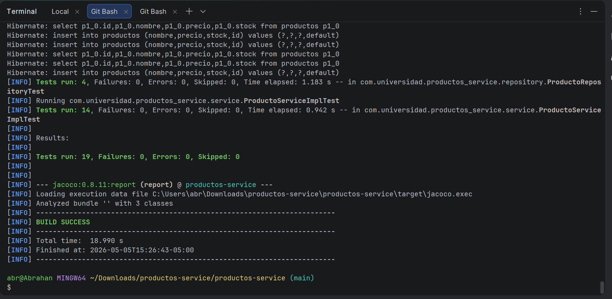
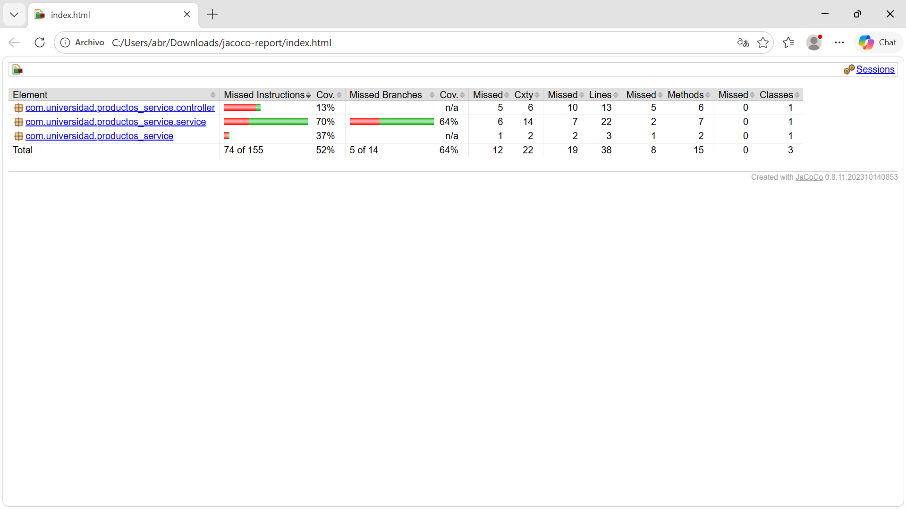

# Productos Service


## Descripción

Microservicio REST de gestión de productos desarrollado con **Spring Boot 3.3.x** y **Java 21**.
El proyecto implementa una arquitectura en capas (dominio, repositorio, servicio y controlador)
con una suite completa de pruebas que cubre las capas de persistencia, negocio y web.

Las pruebas unitarias usan **JUnit 5 + Mockito** para aislar la lógica de negocio de sus
dependencias. Las pruebas de integración utilizan `@DataJpaTest` (con base de datos H2 en
memoria) para verificar el repositorio JPA, y `@WebMvcTest` para verificar el controlador REST.
Todo el pipeline de CI/CD está automatizado con **GitHub Actions**, que ejecuta las pruebas
automáticamente en cada push y genera un reporte de cobertura con **JaCoCo**.

---

## Tecnologías utilizadas

| Tecnología | Versión | Uso |
|---|---|---|
| Java | 21 | Lenguaje principal |
| Spring Boot | 3.3.x | Framework base |
| Spring Data JPA | 3.3.x | Capa de persistencia |
| H2 Database | — | BD en memoria para pruebas |
| Lombok | — | Reducción de boilerplate |
| JUnit 5 | — | Framework de pruebas |
| Mockito | — | Mocking de dependencias |
| JaCoCo | 0.8.11 | Reporte de cobertura |
| GitHub Actions | — | Pipeline de CI/CD |
| Maven | 3.9+ | Gestión de dependencias |

---

## Estructura del proyecto

```
productos-service/
├── .github/
│   └── workflows/
│       └── ci.yml                          ← Pipeline de CI con GitHub Actions
├── src/
│   ├── main/
│   │   ├── java/com/universidad/productos_service/
│   │   │   ├── ProductosServiceApplication.java
│   │   │   ├── domain/
│   │   │   │   └── Producto.java           ← Entidad JPA
│   │   │   ├── repository/
│   │   │   │   └── ProductoRepository.java ← JpaRepository
│   │   │   ├── service/
│   │   │   │   ├── ProductoService.java    ← Interfaz del servicio
│   │   │   │   └── ProductoServiceImpl.java← Lógica de negocio
│   │   │   └── controller/
│   │   │       └── ProductoController.java ← Controlador REST
│   │   └── resources/
│   │       └── application.properties
│   └── test/
│       ├── java/com/universidad/productos_service/
│       │   ├── repository/
│       │   │   └── ProductoRepositoryTest.java  ← @DataJpaTest
│       │   ├── service/
│       │   │   └── ProductoServiceImplTest.java ← JUnit 5 + Mockito
│       │   └── controller/
│       │       └── ProductoControllerTest.java  ← @WebMvcTest
│       └── resources/
│           └── application-test.properties      ← Config H2 para pruebas
├── captura/
│   ├── test.png                            ← Evidencia pruebas en verde
│   └── jacoco-report.png                  ← Evidencia cobertura JaCoCo
├── pom.xml
└── README.md
```

---

## Requisitos previos

- JDK 21 instalado y configurado en el PATH
- Maven 3.9+
- IntelliJ IDEA o VS Code con Java Extension Pack
- Git configurado con nombre de usuario y email

---

## Cómo ejecutar el proyecto

### Clonar el repositorio

```bash
git clone https://github.com/Abrahan07/Patrones-Remolina-post2-u9.git
cd Patrones-Remolina-post2-u9
```

### Compilar el proyecto

```bash
mvn compile
```

### Ejecutar solo las pruebas unitarias

```bash
mvn test
```

### Ejecutar todas las pruebas y generar reporte JaCoCo

```bash
mvn verify
```

### Ver el reporte de cobertura localmente

Después de `mvn verify`, abrir en el navegador:

```
target/site/jacoco/index.html
```

---

## Suite de pruebas

El proyecto cuenta con **19 pruebas en total** distribuidas en tres clases:

### ProductoServiceImplTest — Pruebas unitarias (14 pruebas)
Pruebas con `@Mock` e `@InjectMocks` que aíslan la lógica de negocio del repositorio:

- `crear_datosValidos_retornaProductoGuardado` — verifica creación exitosa
- `buscarPorId_existente_retornaProducto` — verifica búsqueda por ID existente
- `buscarPorId_noExistente_lanzaRuntimeException` — verifica excepción para ID inexistente
- `crear_nombreInvalido_lanzaIllegalArgumentException` — prueba parametrizada con `@NullAndEmptySource` y `@ValueSource`
- `crear_precioInvalido_lanzaIllegalArgumentException` — prueba parametrizada con precios inválidos
- `crear_nombreConEspacios_guardaNombreNormalizado` — verifica normalización con `ArgumentCaptor`
- `eliminar_productoExistente_llamaDeleteById` — verifica interacciones del repositorio

### ProductoRepositoryTest — Pruebas de integración JPA (4 pruebas)
Pruebas con `@DataJpaTest` contra base de datos H2 en memoria:

- `save_asignaIdAutomaticamente` — verifica generación de ID
- `findById_existente_retornaProducto` — verifica búsqueda JPA
- `findAll_retornaListaCompleta` — verifica listado completo
- `deleteById_eliminaProducto` — verifica eliminación

### ProductoControllerTest — Pruebas de integración Web (3 pruebas)
Pruebas con `@WebMvcTest` y `MockMvc` que verifican la capa REST:

- `listarProductos_retorna200ConLista` — verifica GET `/api/productos`
- `crearProducto_datosValidos_retorna201` — verifica POST `/api/productos`
- `buscarProducto_noExistente_retorna404` — verifica manejo de errores HTTP

---

## Evidencia de pruebas en verde

Resultado de `mvn verify` con las 19 pruebas ejecutadas exitosamente:



---

## Cobertura JaCoCo

Reporte generado automáticamente por el pipeline de CI. La capa de servicio
(`ProductoServiceImpl`) alcanza una cobertura del **70%** en líneas, cumpliendo
el umbral mínimo requerido.



---


